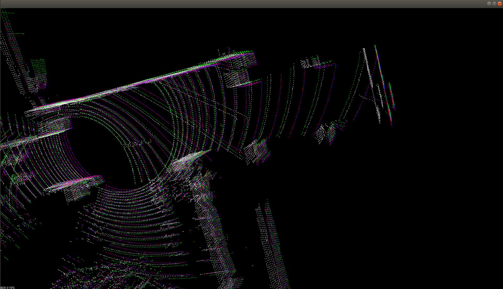
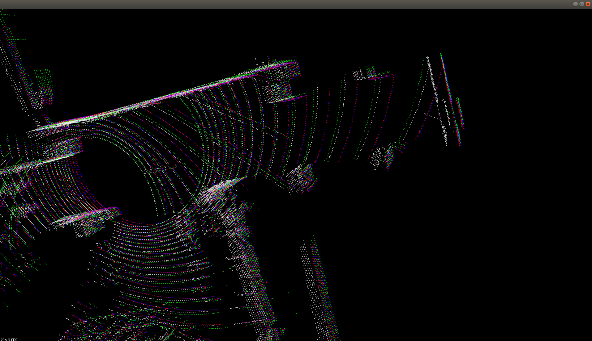

# LITAMIN2
This package is an implementation of litamin2 point cloud matching algorithm.


## Dependencies.
ROS
PCL 
CERES
Eigen3

## Build.
``` 
mkdir -p litamin_ws/src/ && cd litamin_ws/src/
git clone https://github.com/bzdfzfer/litamin2
cd ~/litamin_ws/ && catkin build

```

## Run test program.

```
source devel/setup.bash
rosrun litamin2 litamin2_align ~/litamin_ws/src/litamin2/data/251370668.pcd ~/litamin_ws/src/litamin2/data/251371071.pcd
```

## Results.

.

White --> Source cloud.

Green --> Target cloud.

Blue  --> LM optimization alignment.

Red --> Ceres optimization alignment.


- [GT] Two scan transformation matrix:
```
    0.999941    0.0108432 -0.000635437     0.485657
  -0.0108468     0.999924  -0.00587782      0.10642
 0.000571654   0.00588436     0.999983   -0.0131581
           0            0            0            1
```

#### Voxel to Voxel matching.

Voxel resolution is set to 0.5m.


- LM based optimization with zero lambda.
* speed: repeative run of 100 times, average 32.7774[msec].
* accuracy: 
``` bash
align result: 
   0.999867   0.0162508 -0.00157465    0.491412
 -0.0162532    0.999867 -0.00147708    0.117267
 0.00155044  0.00150248    0.999998  -0.0306296
          0           0           0           1
```
- Ceres based solution.
* speed: repeative run of 100 times, average 132ms.
* accuracy: 
``` bash
align result: 
   0.999875   0.0157213 -0.00137114    0.465903
 -0.0157243    0.999874 -0.00218937    0.114884
 0.00133655  0.00221065    0.999997  -0.0321361
          0           0           0           1
```

#### Point to Voxel matching.

Voxel resolution is set to 3m.


- LM optimization.
* speed: 100 times run average time: 38.8906[msec]
* accuracy:
``` bash
align result: 
   0.999903   0.0138753 -0.00154203    0.489225
 -0.0138811    0.999896 -0.00385291    0.116165
 0.00148841  0.00387394    0.999991  -0.0299192
          0           0           0           1
```

- Ceres:
* speed: 100 times run average time: 461.8[msec]
* accuracy: 
``` bash
align result: 
   0.999902   0.0138793  0.00193534    0.455404
 -0.0138774    0.999903 -0.00103081    0.110234
-0.00194946  0.00100385    0.999998  -0.0399503
          0           0           0           1
```


#### Newton method involved with ICP and covariance cost function together.
- Newton optimization
* accuracy:
```bash
   0.999905   0.0136979 -0.00152955    0.488704
 -0.0137038    0.999898 -0.00391775    0.115806
 0.00147573  0.00393834    0.999991  -0.0297435
          0           0           0           1
```

#### Alignment quality Comparison: 
Zoom in details. 
<center class="half"> 
	
	
</center>

## References.
* Yokozuka M, Koide K, Oishi S, et al. LiTAMIN2: Ultra Light LiDAR-based SLAM using Geometric Approximation applied with KL-Divergence, ICRA2021. [litamin2 paper link](https://arxiv.org/abs/2103.00784).
* Kenji Koide, Masashi Yokozuka, Shuji Oishi, and Atsuhiko Banno, Voxelized GICP for fast and accurate 3D point cloud registration, ICRA2021. [fast-gicp paper link](https://staff.aist.go.jp/shuji.oishi/assets/papers/preprint/VoxelGICP_ICRA2021.pdf).
* Official implementation of Fast-GICP. [fast-gicp implementation](https://github.com/SMRT-AIST/fast_gicp).
* Another implementation of Fast-GICP using Ceres. [fastgicp re-implementation](https://github.com/FishInWave/fast-gicp).

## TODO. [DONE]
~~* Current implementation only uses ICP cost, the covariance rotation cost function is not successfully added. (due to instable convex optimization of trace terms. )~~
~~* Find Hessian matrix of E_{ICP} and E_{COV} and implement Newton method mentioned in the paper.~~

~~The Hessian of ICP cost is added in current implenentation, but the contribution on accuracy improvement is negligible. This proves that jacobian approximatin is good enough for hessian computation.~~

**Someone interested in the derivation process of Hessian matrix and Jacobian matrix, please refer to "litamin2_derivatives.pdf".**

~~**If someone knows how to compute the derivative of trace with respect to lie so(3), please teach my in the issue.**~~

**I have derived the jacobian and hessian matrix of COVARIANCE cost part in "[litamin2_derivatives.pdf](litamin2_derivatives.pdf)".**
**The implementation of this part is coded at "[litamin2point2voxelnewton_impl.hpp](include/litamin2/impl/litamin2point2voxelnewton_impl.hpp)".**


## KITTI dataset.
The KITTI odometry dataset is used to run this algorithm, part of seq 00 is shown below.


To run this test, one can use odometry dataset:
```bash
rosrun litamin2 test_kitti_align path_to_your_kitti_odometry_dataset KITTI output_path
```
Or run with raw dataset:
```bash
rosrun litamin2 test_kitti_align path_to_your_kitti_raw_dataset KITTI_raw output_path

```
